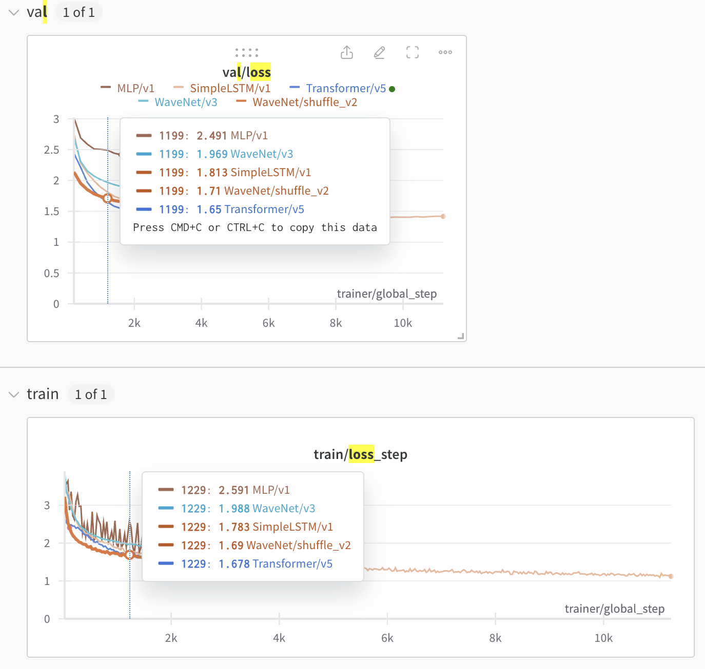

# AI
Personal AI testbed and playground.

to run experiments:
```bash
python afi/run_experiments.py -u v1
```

to run tests:
```bash
pytest
```

# Comparing Next Token Predictors

Various next token predictors (MLP, wavenet, lstm, transformer, etc).



```python
from ai.train import TrainNNConfig
import torch

config = TrainNNConfig.from_yaml_file('/mnt/ssd3/user/spock/projects/AI/experiments/next_token/Transformer/v5/train.config')
dm = config.datamodule.i()
dm.prepare_data()
model_class = config.lightning_module.get_target()
model = model_class.load_from_checkpoint('/mnt/ssd3/user/spock/projects/AI/experiments/next_token/Transformer/v5//checkpoints/epoch0__step3600.ckpt')
x,y = next(iter(dm.train_dataloader()))
model = model.to('cpu')
with torch.inference_mode():
    y_hat = model(x)
    y_hat.shape

# dm.train_dataloader.dat
g = model.generate(x[:1,:], 500)
print(''.join(dm.ds_train.decode(g[0])))
```

```
BOLINGHARISHON BOLING HENRY VI:
The queen, as wish a tongue city.

FRIAR LADURENCE:
Come, one brital kind you mind your gosfending of curches,
But which the was narrief is and his face;
Be tuke and wrick eagly one dooe, and and fretune,
Unto a daughneral that what our neature.. Do you no experse,
Will revery eld not so.

SICINIUS:
'God no vitly peace, and read will loadful thing no sons,
That I would past you patience; yet her drops to of
braise: but my strange, go! But fond my hath this niften draught,
You hands not driwth a day.

AUTOLYCUS:
What should Make men, and say that all detere times
And fid is at thy stone arms. But thy soul shall well
Capule in that smil hencember me in thy life,
Can lively and brincew-blow Cown: whose implace him them wilt.

Second Marcius,
If thy commorderer coves the mine of Coriolanus,
Liked whoscass should thy Kind 'day's patient
To have frondly day a hope and king have.
Her is ensived the poticle.
Ah, all reclivers underm our case;
And only hath his c
```