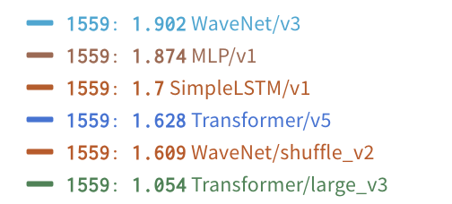
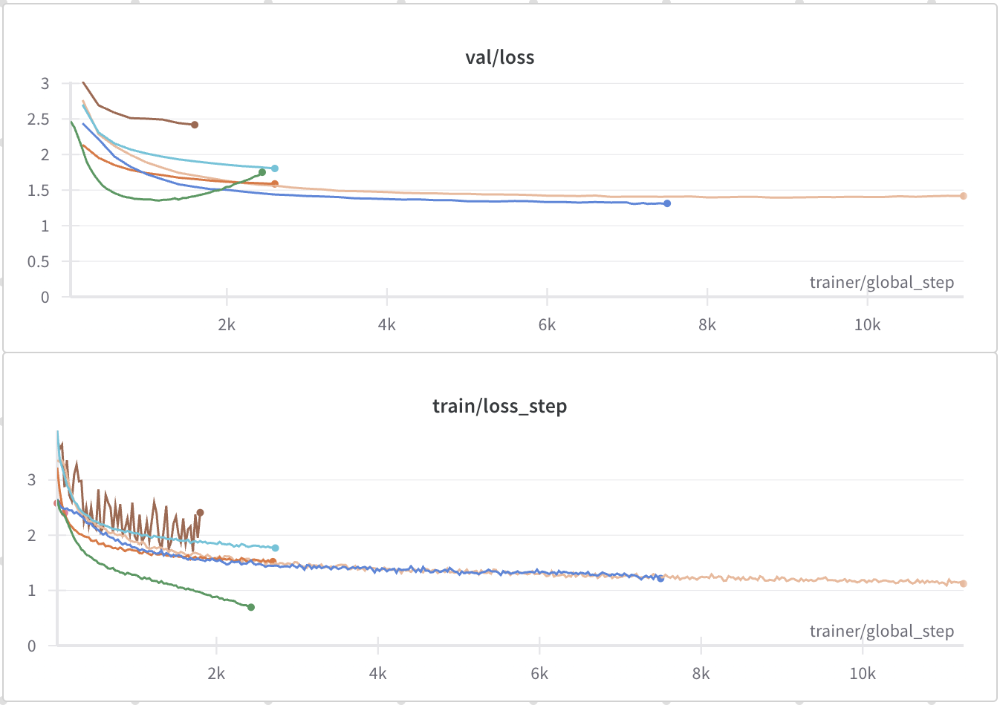
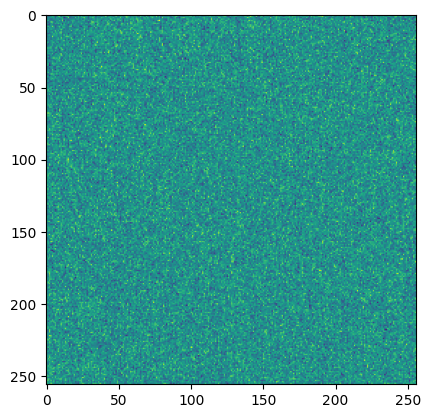
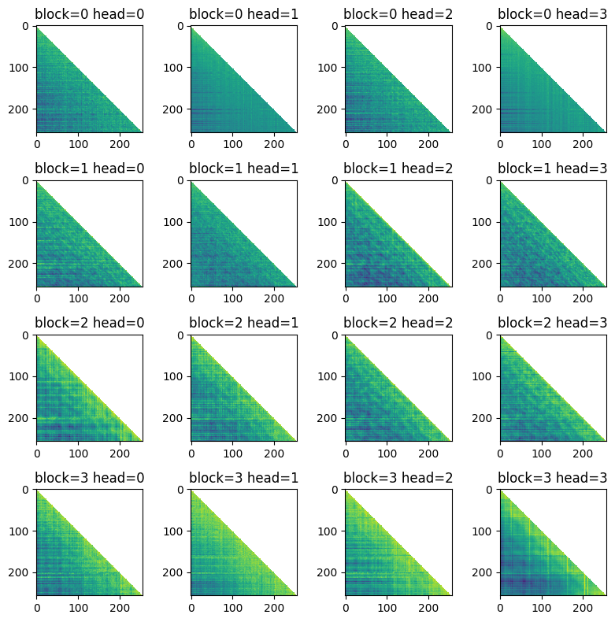
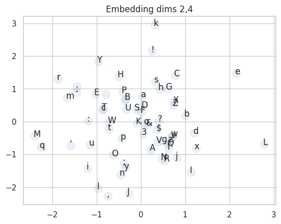

# AI
Personal AI testbed and playground.

to run experiments:
```bash
python afi/run_experiments.py -u v1
```

to run tests:
```bash
pytest
```

# Comparing Next Token Predictors

train losses at step 1559:


Various next token predictors (MLP, wavenet, lstm, transformer, etc).

```python
from ai.train import TrainNNConfig
import torch

config = TrainNNConfig.from_yaml_file('/mnt/ssd3/user/spock/projects/AI/experiments/next_token/Transformer/v5/train.config')
dm = config.datamodule.i()
dm.prepare_data()
model_class = config.lightning_module.get_target()
model = model_class.load_from_checkpoint('/mnt/ssd3/user/spock/projects/AI/experiments/next_token/Transformer/v5//checkpoints/epoch0__step3600.ckpt')
x,y = next(iter(dm.train_dataloader()))
model = model.to('cpu')
model.eval()
y_hat = model(x)
y_hat.shape

g = model.generate(x[:1,:], 500)
print(''.join(dm.ds_train.decode(g[0])))
```

```
CLARENCE:
Your lordship and dance sweet.
Therefore me Doricle, master not cutcher enclaim
To chose biins of mine execution,
Who can they on, they would be seen of them:
They do fear upon my soul promise of treasons,
Whereins to have deserved and bear it.

QUEEN MARGARET:
Setting fill'd honour body on,
That she's own nothing babe.

First Murderer:
His, my dearer sorrow;
But a while at our affairs rights of many so,
Yet is; where's pilgrimage is well in the wedding of discourse;
Until have wash'd at sea.

CLIFFORD:
O God's mother!

NORFOLK:
By heavy captain: there is the greatest and the duke
That city a man that midst death. Bring children,
Which is the fame of my full of the law,
Lest my mooning dragon of my stitue,
Which this stars is my bhost tale time best,
The Edward that kill'd and slain.

QUEEN MARGARET:
O much devotion! why doth have been high gentle
Can not take his business of small fight.
Then he's ready stop: and pretty too;
But you playfeit, she days are speaks, it is then and born.
And took it of my steed, that lord!
What should be gone that oppersition? have makest,
Thy subjected have then so write sume Aboot,
I was too pass'd at thy grace of my far,
Until my happy wreport come against thy earth;
But one honour'd to wail.
```

## Positional Encodings (learned)


## Attention Maps


## Character embeddings

